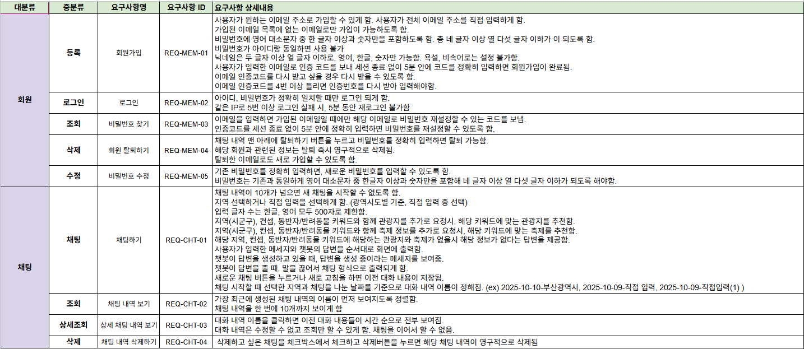
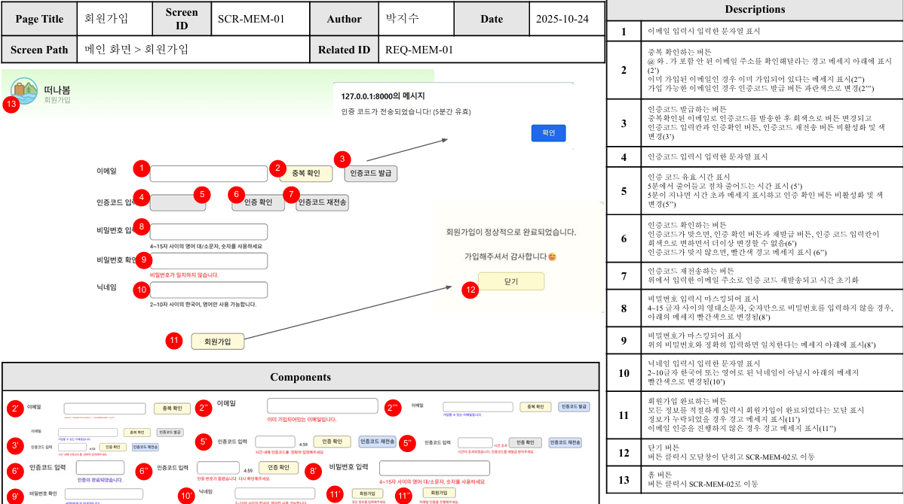
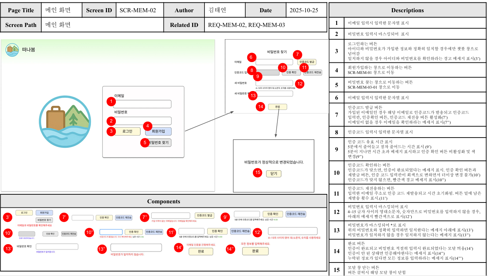
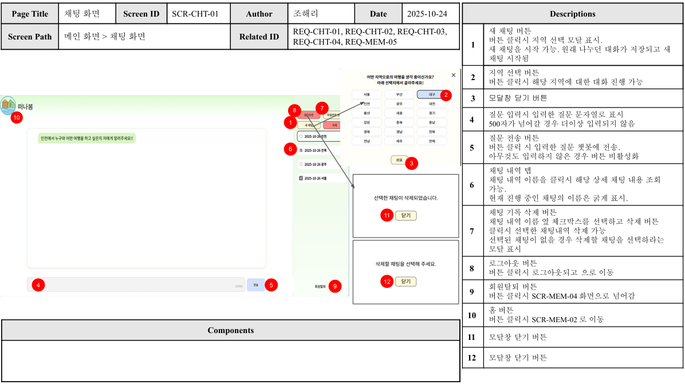
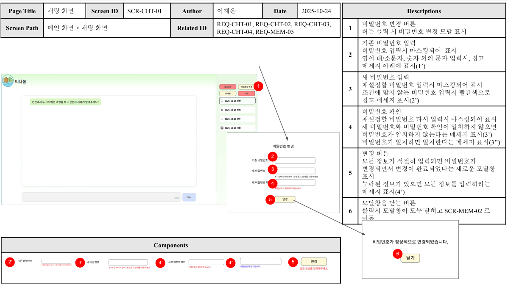
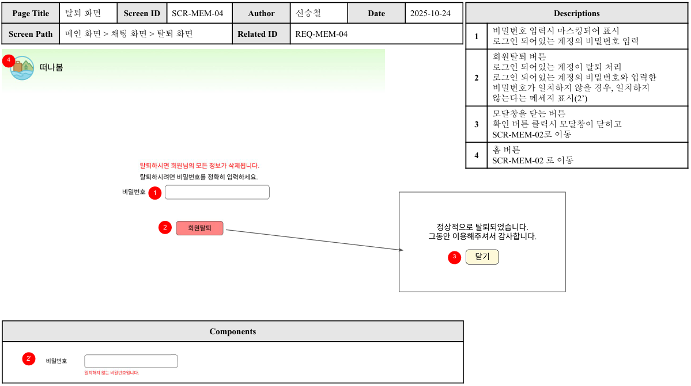
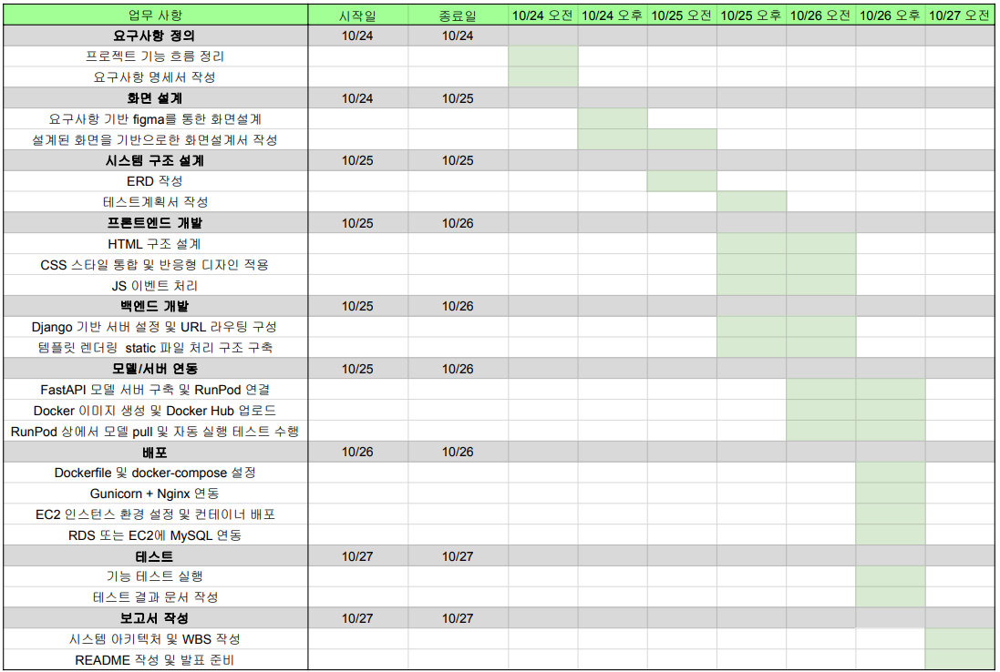
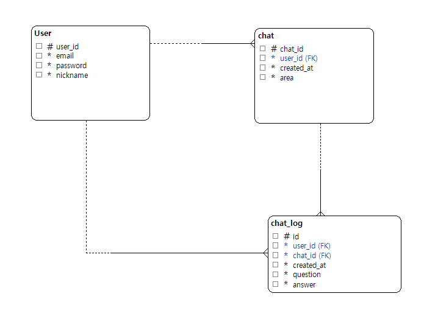
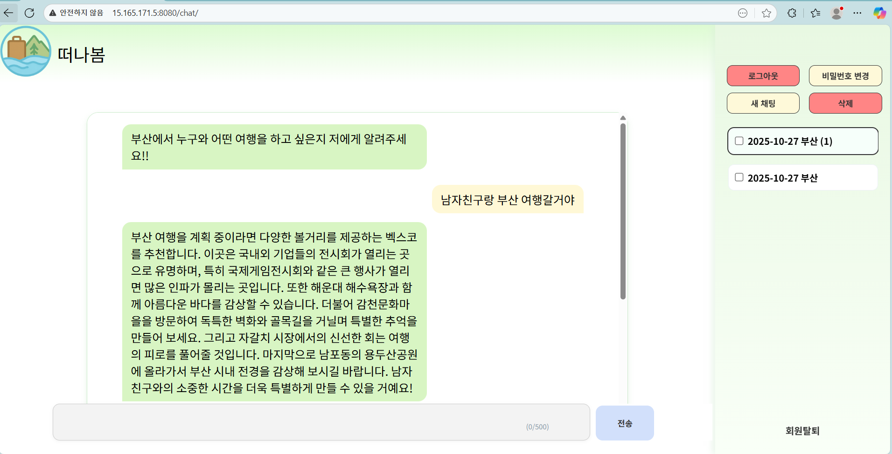

# SKN17-4th-3Team
# 🌸우리와 함께 떠나봄🌸

---
# 📚 Contents

 

1. [팀 소개](#1-팀-소개)
2. [프로젝트 개요](#2-%EF%B8%8F-프로젝트-개요)
3. [기술 스택](#3-%EF%B8%8F-기술-스택)
4. [시스템 아키텍처](#4-시스템-아키텍처)
5. [요구사항 명세서](#5-요구사항-명세서)
6. [화면설계서](#6-화면설계서)
7. [WBS](#7-WBS)
8. [ERD](#8-EDA)
9. [테스트 계획&결과 보고서](#9--테스트-계획-및-결과-보고서)
10. [수행결과](#10-수행결과)
11. [한 줄 회고](#11-한-줄-회고)

 

 

## 1. 팀 소개
 

### 💡팀명 : **오솔길**

### 🌟 팀원 소개

 

| 🥇 김태연 | 🥇 박지수 | 🥇 신승철 | 🥇 이재은 | 🥇 조해리 |
|:---:|:---:|:---:|:---:|:---:|
|  |  |  |  |  |
| [@Taeyeon514](https://github.com/Taeyeon514) | [@0lipa](https://github.com/0lipa) | [@ssshinnpson](https://github.com/ssshinnpson) | [@JAEEUN0129](https://github.com/JAEEUN0129) | [@Haer111](https://github.com/Haer111) |

 

---

## 2. 📽️ 프로젝트 개요

 

## **🛫프로젝트 명 : 떠나봄🌸** 

 

### 2.1 프로젝트 소개

 

**관광지 정보를 알려주고 코스를 짜주는 챗봇 개발**

 

본 프로젝트는 **여행지 혹은 코스를 추천**해주는 관광 챗봇을 개발하는 것을 목표로 합니다.  
사용자가 **누구와 함께, 어떤 방식으로, 어디로 여행하고 싶은지** 등의 정보를 질문하면, 챗봇이 그에 맞는 여행지 혹은 코스를 추천해주고 이에 대한 설명을 추가적으로 해줍니다.  

---

### 2.2 프로젝트 필요성

 

#### 1. 할루시네이션  

 

 
Malta대학교의 Mark Anthony Camilleri 교수의 연구에 따르면, 최근 여행·관광 서비스 분야에서 디지털 미디어와 대화형 서비스 기술(챗봇 등)은 빠르게 확산되고 있습니다. 고객들은 여행 상품 검색, 일정 예약·변경, 환불 요청 등 다양한 활동을 온라인에서 수행하며, 이 과정에서 인공지능 기반 대화 시스템을 활용하는 경우가 늘어나고 있습니다.

>> 예시:
>>
>> 
>>
>> **위의 사진에서 보이는 경기도 수원의 광복기념관은 존재하지 않는 곳입니다.**

 

#### 2. 관광지 검색 불편  

대부분 사람들이 관광지를 검색할 때 지도나 블로그, 유튜브 등에 의존하곤 합니다. 하지만 지도나 블로그 등의 자료도 완벽한 해답이 되지는 못합니다. **광고성 장소**가 너무 많기 때문입니다.  
그래서 여행지를 검색할 때 많은 시간과 수고를 들이는 경우가 많습니다. 지도, 블로그 등에서 검색하는 이유는 또 있습니다. 바로 **리뷰** 때문입니다. 그 관광지에 다녀온 사람들이 **방문해서 어떤 것을 느꼈는지, 누구와 갔는데 어땠는지** 등을 알기 위해 사람들이 생각이 담겨있는 이러한 SNS를 주로 이용하곤 합니다. 그러나 단순 검색만으로는 이러한 맥락적인 정보를 얻기 힘듭니다. 따라서 이러한 것들을 확인하기 위해 리뷰나 블로그를 일일이 찾아봐야 하는 불편함이 있습니다.
 

 

<h2>기대 효과</h2> 

#### 1. 관광지 검색 시간 단축  
#### 2. 사용자의 상황(관계, 취향 등)에 맞는 맞춤형 관광지 및 코스 추천  

---

### 2.3 프로젝트 목표

 

- **1차 목표 : 챗봇 기획안을 토대로 웹 페이지 구현**
- **2차 목표 : 구현된 웹 페이지 배포**
- **3차 목표 : 배포한 웹 페이지에 챗봇 연동**

 

---

## 3. 🛠️ 기술 스택

| **분류**         | **기술/도구**                                                                            |
|------------------|------------------------------------------------------------------------------------------|
| **Language**         |      |
| **Development**   |    
| **Vector DB**	|	|
| **Framework**	|  	|
| **UI/FrontEnd**	|    |
| **Server/WSGI**	|  |
| **Container**	|   |
| **Cloud Infra**	|  |
| **DB**	|  |
| **Model Hub**	|  |
| **Collaboration Tool**      |   |

 

---

## 4. 🧩시스템 아키텍처 

 

---

## 5. 🖼️ 요구사항 명세서

---

## 6. 📝화면설계서

  
    
    
    

  
    
    

---

---

## 7. ⭐WBS

---

## 8. ERD

---

## 9. 📻 테스트 계획 및 결과 보고서

  
---
## 10. 수행결과

#### 한계점/개선 방향
- 최선을 다했으나, 요구사항 명세서에서 계획했던 부분들을 실제 구현에서 놓쳤습니다.
- 3차 프로젝트 이후 성능을 개선하고자 전처리까지 진행했었던 축제 데이터를 추가하여 지금보다 나은 떠나봄을 만들고자 합니다.

---

## 11. 한 줄 회고

| **이름** | **회고 내용** |
|---|---|
| 김태연 | 3차에서 진행했던 내용을 우리가 평소 사용하던 웹 형식으로 구현할 수 있다는 사실이 매우 흥미로웠습니다. 동시에 구현을 진행하면서 어려움을 많이 느꼈고, 특히 css 수정과 모달 연결 부분에서 시간 소요가 컸습니다. 이후 AWS를 통한 배포 과정이 많이 어렵고 힘들었으나, 동시에 구현을 하는 중간중간에도 단시간에 현재 상황이 눈에 보여서 재미를 느꼈던 점도 있었습니다.  |
| 박지수 | 이번 프로젝트를 통해 웹페이지를 디자인하고 구현하고 배포하는 전체적인 과정에 참여하면서 front-end와 back-end를 전반적으로 이해할 수 있는 계기가 되었습니다. 웹페이지에 있는 디자인 요소들과 javascript 코드를 연결시켜서 어떤 코드를 추가해야 원하는 디자인 요소 변화를 얻어낼 수 있을지 고민하는 과정이 어려웠지만 특히 흥미로웠습니다. 후에 인포 페이지나 채팅 내용 검색 등 여러 가지 페이지를 좀 더 추가해 디벨롭해보고 싶습니다. |
| 신승철 | 화면 스타일을 설계한대로 구현하는게 제대로 된 기능을 넣는 것과 맞먹을 정도로 힘든지 몰랐다. 특히 AWS로 클라우드 서버에 프로젝트를 배포할 때 로컬에서 확인하던 것과는 다른 오류가 많이 나와 당황했습니다. 그래도 하나씩 연결하면서 docker image로 프로젝트도 가동하고 FastAPI 서버도 가동하는걸 보고 편리하고 유용한 기술이라고 느꼈습니다. |
| 이재은 | Django에서 기능별로 앱을 분리하고 html, css, js 코드를 작성하면서 백엔드 로직과 프론트엔드 요소가 유기적으로 작동하는 구조를 이해하였습니다. 구현 과정에서 반영이 원활하지 않아 어려움이 있었지만, 요청 흐름과 연결 구조를 분석하며 문제를 해결했던 경험을 통해 웹 서비스 아키텍처에 대한 이해를 한층 높힐 수 있었던 프로젝트였습니다. |
| 조해리 | 웹서비스를 사용자 입장에서 고려하며 설계하는 것부터 그걸 실제 구현으로 옮기는 것까지의 과정이 정말 쉽지 않았습니다. 또한 배포 과정에서도 어려움이 많았지만 이러한 문제들을 해결 해 나가며 스스로 성장해 나가는 것을 느낄 수 있었습니다.  |

